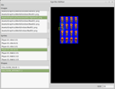

# Moonfall

Moonfall is the name of a game engine that I spent several months developing back in 2008. It leveraged SDL for
graphics, Lua for in-game scripting, and wxWidgets for the built-in developer tools. The cross-platform engine was
written using the Code::Blocks IDE, but Visual Studio project files are also available.

The game was partially inspired by [Harvest Moon](http://en.wikipedia.org/wiki/Harvest_Moon_%28video_game%29) for the
Super Nintendo and [When They Cry](http://en.wikipedia.org/wiki/Higurashi_When_They_Cry) by [07th
Expansion](http://en.wikipedia.org/wiki/07th_Expansion). The protagonist is a city dweller, who upon inheriting a small
farm from a distant relative, decides to try his hand in agriculture. He finds the residents of the nearby small town a
friendly bunch, but something about them does not seem right. Everyone is appears to be hiding something from the
player, who must uncover the truth to survive. In short, this is (as I have described it to my friends), "Harvest Moon
with Murder."

[](img/gameplay.png)
[](img/sprite-editor.png)
[](img/console.png)
[](img/asset-editor.png)
[](img/map-editor.png)

## Technology

From a technical point of view, the game engine was an exercise in creating a completely data driven game. In
retrospect, it was probably over-engineered, but in general it was flexible and I liked what I could do with it. At the
core of the engine was the `Actor` class, the functionality of which could be expanded through add-on properties. The
property definitions were specified in XML; for example, below is the definition for the playable character:

```xml
<Actor alias = "Player.01" dynamic = "1" layer = "4" thumbnail = "Player.01.Idle.S.01">
    <Properties>
        <Animation />
        <Script resource = "Player.01.Default" />
        <Physics />
    </Properties>
</Actor>
```

In addition to the self-explainable `Animation` and `Physics` properties, you can see a `Script` node which associates a
Lua script with the actor. Scripts would get notifications about events such as `OnActorUpdate`, during which custom
processing could take place:

```lua
function OnActorUpdate(elapsed)
    if InputIsKeyTriggered(META_KEY_USE) then
        DoActorUse()
        return
    elseif InputIsKeyPressed(META_KEY_UP) then
        DoActorWalk(DIRECTION_NORTH)
        return
    elseif InputIsKeyPressed(META_KEY_DOWN) then
        DoActorWalk(DIRECTION_SOUTH)
        return
    elseif InputIsKeyPressed(META_KEY_LEFT) then
        DoActorWalk(DIRECTION_WEST)
        return
    elseif InputIsKeyPressed(META_KEY_RIGHT) then
        DoActorWalk(DIRECTION_EAST)
        return
    end

    DoActorIdle(playerDirection)
end
```

Scripts can directly interact with properties on the parent `Actor` and can communicate with surrounding world via a
messaging system. This made it possible to build any game object imaginable by editing a couple of XML files and some
simple scripting.

```lua
function DoActorWalk(direction)
    if playerAction == ACTION_WALK and playerDirection == direction then
        return
    end

    ActorPhysicsSetVelocity(playerId, playerWalkVelocities[direction])
    ActorAnimationSet(playerId, playerWalkAnimations[direction])
    ActorAnimationPlay(playerId, true)

    playerDirection = direction
    playerAction = ACTION_WALK
end

function DoActorUse()
    actorsIds = ActorPhysicsQueryShapeCollisions(
        playerId,
        ACTOR_SHAPE_TYPE_COLLISION_INTERACT
    )

    for i, v in ipairs(actorsIds) do
        ActorScriptSendMessage(v, "interact", { user = playerId })
    end
end

```

I eventually stopped work on Moonfall due to a lack of time, combined with the fact that I am not an artist and could
not author the assets required to develop this into a complete game.
